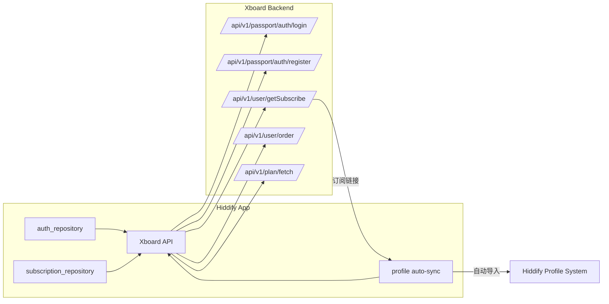
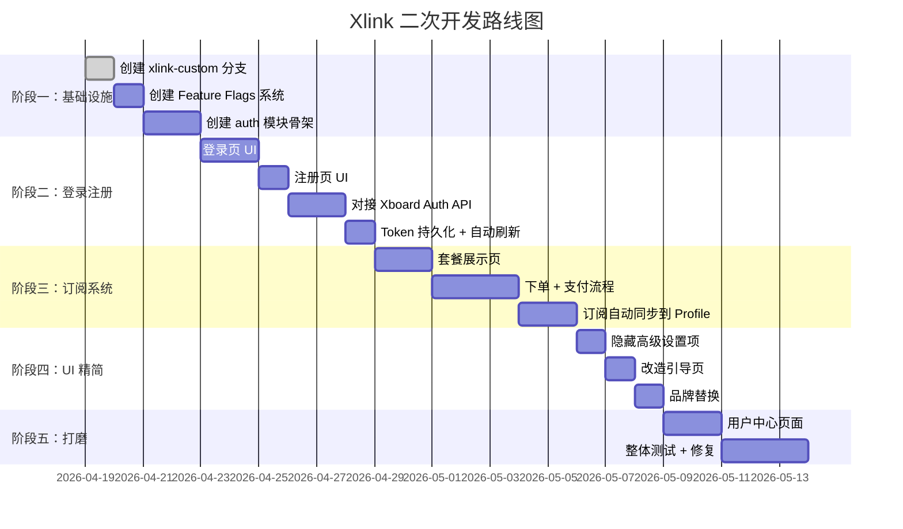

# Hiddify-App 二次开发策略建议

## 📊 当前项目概况

| 项目信息 | 详情 |
|---------|------|
| 当前版本 | v4.1.1 (tag: `dev-v4.1.1` 分支) |
| 技术栈 | Flutter + Riverpod (hooks_riverpod) |
| 路由方案 | go_router (StatefulShellRoute) |
| 状态管理 | Riverpod + code generation |
| 数据库 | 本地 DB (drift/sqlite) |
| 国际化 | slang (project.inlang) |

### 现有 Feature 模块

```
lib/features/
├── about/           # 关于页面
├── app/             # App 入口 Widget
├── app_update/      # 应用更新
├── auto_start/      # 自启动
├── common/          # 公共组件
├── connection/      # VPN 连接管理（核心）
├── deep_link/       # 深度链接
├── home/            # 首页（连接按钮 + Profile卡片）
├── intro/           # 引导页
├── log/             # 日志
├── per_app_proxy/   # 分应用代理
├── platform_specific/ # 平台特定功能
├── profile/         # 订阅 Profile 管理
├── proxy/           # 代理节点选择
├── route_rules/     # 路由规则
├── settings/        # 设置（General/DNS/Inbound/Route/TLS/WARP）
├── shortcut/        # 快捷操作
├── stats/           # 统计
├── system_tray/     # 系统托盘
└── window/          # 窗口管理
```

---

## 🎯 策略一：Git 分支保护（推荐）

> [!IMPORTANT]
> 这是**最推荐**的方案。用 Git 的版本控制能力保留原始代码快照，而不是在代码层面维护两套 UI。

### 操作步骤

```powershell
# 1. 确保当前 dev-v4.1.1 分支代码干净（已确认 ✅）
git checkout dev-v4.1.1

# 2. 创建一个"原始参考"标签，永久锁定当前状态
git tag v4.1.1-original-snapshot

# 3. 从当前代码创建你的二次开发分支
git checkout -b xlink-custom

# 4. 后续所有修改都在 xlink-custom 上进行
```

### 日常对比参考方式

```powershell
# 随时查看你改了哪些文件
git diff v4.1.1-original-snapshot --stat

# 查看某个具体文件的原始版本
git show v4.1.1-original-snapshot:lib/features/home/widget/home_page.dart

# 对比某个文件的改动
git diff v4.1.1-original-snapshot -- lib/features/home/widget/home_page.dart

# 如果搞坏了某个文件，从原始版本恢复
git checkout v4.1.1-original-snapshot -- lib/features/home/widget/home_page.dart
```

> [!TIP]
> 你可以随时用 `git show v4.1.1-original-snapshot:<文件路径>` 查看任何文件的原始版本，比在代码里保留两套 UI 干净得多。

---

## 🏗️ 策略二：Feature Flag 渐进式改造

在 `xlink-custom` 分支上，用 Feature Flag 控制新旧功能切换，方便调试。

### 1. 创建全局 Feature 开关

```dart
// lib/core/preferences/feature_flags.dart
class FeatureFlags {
  /// 是否启用 Xlink 自定义登录流程
  static const bool enableXlinkAuth = true;
  
  /// 是否隐藏高级设置（DNS/Inbound/TLS/WARP 等）
  static const bool hideAdvancedSettings = true;
  
  /// 是否显示订阅购买页面
  static const bool enableSubscriptionShop = true;
  
  /// 是否隐藏手动添加 Profile
  static const bool hideManualProfile = true;
}
```

### 2. 在路由中使用 Feature Flag

```dart
// routing_config_notifier.dart 中的 redirect 逻辑
redirect: (context, state) {
  // 新增：检查登录状态
  if (FeatureFlags.enableXlinkAuth) {
    final isLoggedIn = ref.read(authStateProvider);
    if (!isLoggedIn && state.matchedLocation != '/login') {
      return '/login';
    }
  }
  
  // 原有逻辑保持不变...
  final introCompleted = ref.read(Preferences.introCompleted);
  ...
}
```

---

## 📁 策略三：新功能模块的推荐目录结构

> [!NOTE]
> 遵循 Hiddify 现有的 Feature-First 架构模式，每个新功能独立成模块。

### 需要**新增**的模块

```
lib/features/
├── auth/                          # 🆕 登录注册
│   ├── data/
│   │   ├── auth_repository.dart       # API 调用（对接 Xboard 后端）
│   │   └── auth_data_providers.dart   # Riverpod providers
│   ├── model/
│   │   ├── user_model.dart            # 用户数据模型
│   │   └── auth_state.dart            # 认证状态
│   ├── notifier/
│   │   └── auth_notifier.dart         # 状态管理（登录/登出/Token刷新）
│   └── widget/
│       ├── login_page.dart            # 登录页
│       ├── register_page.dart         # 注册页
│       └── forgot_password_page.dart  # 忘记密码
│
├── subscription/                  # 🆕 订阅管理
│   ├── data/
│   │   └── subscription_repository.dart
│   ├── model/
│   │   ├── plan_model.dart            # 套餐模型
│   │   └── order_model.dart           # 订单模型
│   ├── notifier/
│   │   └── subscription_notifier.dart
│   └── widget/
│       ├── plans_page.dart            # 套餐列表
│       ├── plan_card.dart             # 套餐卡片
│       ├── order_page.dart            # 下单页
│       └── my_subscription_page.dart  # 我的订阅
│
├── user_profile/                  # 🆕 用户中心（区别于 Profile=订阅配置）
│   ├── widget/
│   │   └── user_profile_page.dart     # 账户设置页
│   └── notifier/
│       └── user_profile_notifier.dart
```

### 需要**修改**的现有模块

| 模块 | 修改内容 |
|------|---------|
| `intro/` | 改造引导页 → 登录/注册入口 |
| `home/` | 首页加入订阅状态卡片、隐藏手动添加 Profile 按钮 |
| `profile/` | 登录后自动从 Xboard API 拉取订阅链接，替代手动添加 |
| `settings/` | 精简设置项，隐藏对终端用户无意义的高级选项 |
| `about/` | 替换品牌信息 |

### 可以**直接删除/隐藏**的模块

| 模块 | 理由 |
|------|------|
| `per_app_proxy/` | 可选隐藏，大部分用户不需要 |
| `route_rules/` | 可选隐藏 |
| `settings/sections/dns_options_page.dart` | 隐藏 |
| `settings/sections/inbound_options_page.dart` | 隐藏 |
| `settings/sections/tls_tricks_page.dart` | 隐藏 |
| `settings/sections/warp_options_page.dart` | 隐藏 |
| `app_update/` | 替换为自己的更新源 |

---

## 🔌 策略四：与 Xboard 后端对接架构



### 核心对接逻辑

```dart
// 登录成功后自动同步订阅到 Hiddify 的 Profile 系统
Future<void> syncSubscription() async {
  // 1. 从 Xboard 获取订阅链接
  final subscribeInfo = await xboardApi.getSubscribe(token);
  final subscribeUrl = subscribeInfo.subscribeUrl;
  
  // 2. 利用 Hiddify 现有的 Profile 添加能力
  await ref.read(profileRepositoryProvider).requireValue
    .addByUrl(subscribeUrl, markAsActive: true);
  
  // 3. Profile 添加后 Hiddify 会自动解析节点
}
```

---

## 📋 推荐的实施顺序



---

## ⚠️ 关键注意事项

> [!WARNING]
> ### 1. 不要删除代码，用 Feature Flag 隐藏
> 隐藏功能比删除功能安全得多。`FeatureFlags.hideAdvancedSettings` 比直接删除 `dns_options_page.dart` 好——你随时可以切回去调试。

> [!WARNING]
> ### 2. Profile 系统是核心，不要破坏它
> Hiddify 的 `profile/` 模块负责订阅链接的解析、节点提取、自动更新。你的 `subscription/` 模块应该**在上层调用**它，而不是替换它。

> [!CAUTION]
> ### 3. 升级合并策略
> 如果未来 Hiddify 上游发布了新版本（如 v4.2.0），你需要：
> ```powershell
> git fetch origin
> git checkout xlink-custom
> git merge v4.2.0  # 合并上游更新，解决冲突
> ```
> 这就是为什么建议用 Feature Flag 而不是大面积删除代码——冲突会少很多。

> [!IMPORTANT]
> ### 4. 保持现有架构风格
> - **Riverpod Provider** 而不是 StatefulWidget 手动管理状态
> - **Repository 模式** 分离 API 调用和业务逻辑
> - **go_router** 集中管理路由
> - **slang** 做国际化，不要硬编码字符串

---

## 🚀 立即可以执行的第一步

```powershell
# 在 e:\code\vpn\hiddify-app 目录下执行：

# 1. 打标签锁定原始版本
git tag v4.1.1-original-snapshot

# 2. 创建二次开发分支
git checkout -b xlink-custom

# 3. 开始你的第一个改动
```

准备好后告诉我，我可以帮你：
1. **创建 auth 模块骨架** — 搭建登录/注册的完整目录结构和基础代码
2. **创建 Feature Flags 系统** — 一键控制功能显隐
3. **改造路由配置** — 加入登录拦截逻辑
4. **对接 Xboard API** — 你已经有 Xboard 后端，我可以直接写对接代码
